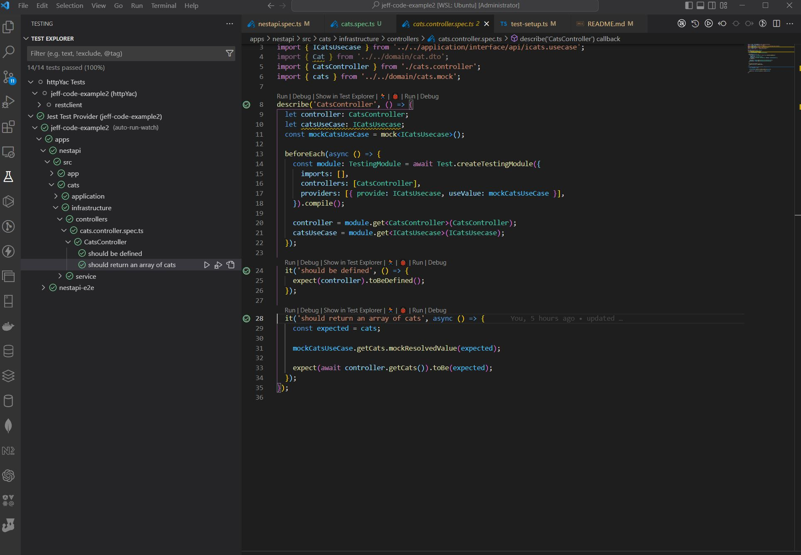

# JeffCodeExample2


## Tech Stack

- [x] Nestjs (express)
- [x] Nx
- [x] DDD
- [x] axios
- [x] swagger
- [x] health check
- [x] lint
- [x] cache
- [x] security (cors, helmet, rate-limited)
- [x] jest
- [x] json-server
- [x] Docker

## Setup project

```javascript
# create project
$ npx create-nx-workspace jeff-code-example2 --preset=nest

# add cat folder,  create three layer
- application
- domain
- infrastructure

# add config
$ yarn add @nestjs/config

# add env
$ yarn add dotenv

# add axios
$ yarn add @nestjs/axios

# add cqrs
$ yarn add @nestjs/cqrs

# add json-server
$ yarn add -D json-server

# swagger
$ yarn add @nestjs/swagger

#  add linter
$ yarn add -D @nrwl/linter

# add healthcheck
$ yarn add @nestjs/terminus

# add cache
$ yarn add cache-manager

# security
# add helmet
$ yarn add helmet

# add rate-limiter
$ yarn add @nestjs/throttler

# add jest mock
$ yarn add -D jest-mock-extended

# add supertest
$ yarn add -D supertest
```

## Run project

```javascript
# restore packages
$ yarn install

# lint
$ yarn lint

# start
$ yarn start

# test
# yarn test

# build
# yarn build
```

## Deploy project

```javascript

# docker file ./apps/nestapi/Dockerfile
$ docker build -f ./apps/nestapi/Dockerfile . -t nestapi

# docker-compose.yml
$ docker-compose up

[Webapi Url](http://localhost:3333/api)
```

## Screenshots

- Swagger
  

- Health Checks
  

- Unit tests
  

- Rest Client tests
  

- Docker
  
